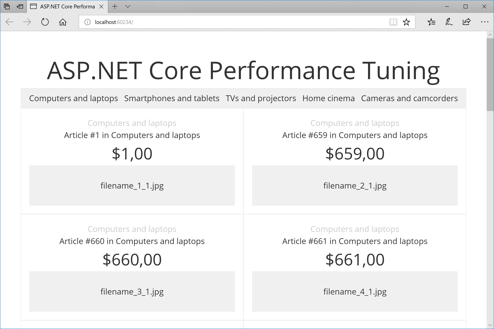

# ASP.NET Core Performance Tuning
This is a demo web application for the
“[ASP.NET Core Performance Tuning](https://medium.com/@dmitry.a.sikorsky/asp-net-core-performance-tuning-db7da4495f17)”
post on the [Dmitry Sikorsky’s blog](https://medium.com/@dmitry.a.sikorsky).
It shows and tests different small features you can use to tune your ASP.NET Core web application performance.

The result looks like this:

*ASP.NET Core Performance Tuning*

## Using the Application

1. Run the application.
2. Run the tester.
3. Change something in code.
4. Run the tester again.
5. Compare the results.